# 2 The Problem of Causal Inference with Observational Data {#the-problem-of-causal-inference-with-observational-data}

In this section, we provide background on the problem of making causal inferences using cohort and other observational data. We begin by noting that causal questions are central to much quantitative research, regardless of the truth of mantras such as 'correlation does not equal causation'. We then provide a theoretical overview of the three main causes of bias (threats to *internal* validity) in observational studies: confounding bias, selection bias, and information bias. The latter two of these typically receive less attention among applied researchers, though are no less capable of leading to incorrect inferences. We use the Potential Outcomes Framework and Causal DAGs as tools for describing these biases and conclude with a discussion of the necessity of observational data for scientific progress, notwithstanding potential problems of bias.

For interested readers, in the Appendix ([Section 8](08-appendix.qmd)), we demonstrate the problem of making causal inferences using cohort and other observational data empirically, reviewing literature that compares results from observational studies and RCTs and shows discrepancies between the two -- in many cases because of important biases present in observational studies (though not always, it must be noted). In the Appendix, we also provide general theoretical perspectives on why correlation may not equal causation in observational studies; though the precise causes of bias may be analysis-specific, there are reasons to expect widespread confounding in practice and broad classes of confounders that are likely to be important in varied situations.

## 2.1 Correlation ≠ Causation: What Next? {#correlation-causation-what-next}

At root, many of the questions in the health and social sciences are causal in nature. For instance, what impact do recessions have on lifetime wages? What effect does parental university education have on the likelihood of attending university oneself? What consequence does low birthweight have for life expectancy? Repeating 'correlation does not imply causation' does not get us very far, either as scientists interested in learning about the world or as citizens hoping to put policy on an evidenced basis. Euphemisms do not help, either -- neutral-sounding terms like "association", "links", and "risk factors" do not satisfy the need to answer causal questions and can instead divert from the causal thinking that is necessary [@ref20803].

The first step in any research programme, then, is to recognise one's aims and which of the three "tasks" of data science -- description, prediction and counterfactual prediction [i.e., causal inference\; @ref20995] -- these aims fit into. Unlike descriptive studies, which are broadly concerned with quantifying and characterising features (e.g., outcomes or events) in a population of interest, or prediction studies, which are focused on identifying patterns in the data with the aim of pattern recognition or forecasting a future event, causal inference is instead concerned with asking how one variable influences another or what would happen if we were to intervene on the world [e.g., how would a person’s education change if they were adopted by highly educated, rather than less educated, parents\; @ref228].

After recognising one's aims, the second step is crafting a good research question; research can fail prematurely, even with technically proficient analyses, if the research question is not well crafted. A good causal research question requires thinking carefully about, and defining, its key features, namely: the exposure ('treatment') and comparator, the outcome, the population, and -- of course -- the particular effect of interest. These should be clear and specific enough that the question can be translated into a statistical 'estimand' [@ref240] -- i.e., a quantity one wishes to estimate, representing a key parameter in a causal system (e.g., the difference in wages at age 33y if someone born in the UK entered adulthood during a recession compared with a healthy economy). One way of doing this can be to specify the research design as a 'target trial': one benefit of RCTs is they encourage the study designer to specify well-defined causal questions by requiring explicit inclusion and exclusion criteria, a specific exposure (and comparator), and so on [@ref241]. This can be an iterative process, requiring an awareness of what is feasible with available data. Target trials will be discussed further in [Section 5.11](05-11-target-trial-emulation.qmd).

To give an example: suppose you are interested in studying the effect of planned Caesarean section on the risk of asthma in childhood. The exposure and comparator would be two levels of a binary variable (1 = Caesarean section, 0 = vaginal delivery). The outcome would need to be defined at a specific time point or in a time window, decided based on subject matter expertise and data availability. For instance, it could be asthma diagnosis between ages 5 and 12 years. The population would be the set of individuals one wishes to make inferences to, determined by the intersection of research interest and data availability: e.g., it may be children in the UK born between 2000 and 2002, the target population of the Millennium Cohort Study. Finally, one would define the specific effect ('estimand') of interest -- e.g., the population average causal ('treatment') effect. Taken together then, the developed causal question might read: "What is the average treatment effect of being born by planned Caesarean section instead of vaginally on the risk of asthma diagnosis at age 5-12 years, among children in the UK born between 2000 and 2002?"

Carrying out this process allows us to more easily translate the question into a well-defined causal estimand, to design an appropriate study, determine the most appropriate analytical strategy required to answer the question [@ref240], and -- crucially -- determine the correct interpretation of the resulting estimate and the population it relates to. Naturally, there exist many different procedures for specifying a good causal question; this section is only intended to serve as a starting point for consideration. For instance, for a continuous exposure, it is advisable to define specific levels of the exposure to compare (e.g., "60 vs 30 minutes of vigorous physical activity per day"), and, additionally, one might consider including specific effect modifiers of interest. See [Section 5.11](05-11-target-trial-emulation.qmd) on Target Trial Emulation and [Section 2.2.1](#what-is-a-causal-effect-counterfactuals-and-the-potential-outcomes-framework), which introduces treatment variation irrelevance, for further discussion of elements worth considering when specifying a suitable causal question.

## 2.2 Threats to (Internal) Validity {#threats-to-internal-validity}

Though observational studies have generated multiple cases where associations have not produced reliable estimates of causal effects (see [Section 8.1](08-appendix.qmd#correlation-causation-a-short-empirical-review), Appendix, for a narrative review), there are numerous examples of observational studies that have. Why is this the case? The ability to estimate an unbiased causal effect in a study sample is referred to as 'internal validity'. Several disciplines have converged upon three major threats to internal validity that can generate bias in (observational) data, sometimes using their own terms or the same terms in different ways. In this section, we introduce these threats using two frameworks: the Potential Outcomes Framework and Causal DAGs.

### 2.2.1 What is a Causal Effect? Counterfactuals and The Potential Outcomes Framework {#what-is-a-causal-effect-counterfactuals-and-the-potential-outcomes-framework}

We first need to define a causal effect. This is a subject of substantial philosophical discussion [@ref466], but in practical terms, statisticians, social scientists and epidemiologists have adopted the counterfactual definition: for an individual, an exposure *X* has a causal effect on an outcome *Y* if that individual's *Y* would be different under different levels of *X*. More formally, for an exposure with two levels:

$$Y_{i}^{X = 1} \neq Y_{i}^{X = 0}\ \text{ for some individual } i$$

where $Y_{i}^{X = x}$ is the level of *Y* for individual *i* had they received *X* = *x*.

We will refer to a person as treated (or exposed) if they in fact received the exposure and untreated (or unexposed) if they in fact did not. In practice, we only observe one state of the world and so we can only see one of these *potential* *outcomes* (i.e., the *factual* rather than *counterfactual* outcome) for any given individual. For treated individuals, this is their outcome having received the treatment ($Y_{i}^{X = 1}$). For untreated individuals, this is their outcome having not received the treatment ($Y_{i}^{X = 0}$).

Given we only observe one potential outcome for each individual, individual causal effects cannot be observed -- this is the "fundamental problem of causal inference" [@ref284]. To estimate causal effects, we instead rely on population quantities -- comparisons between groups -- such as the difference in the mean of *Y* according to levels of *X*. A key causal parameter is the Average Treatment Effect (ATE) -- i.e., the average causal effect across a population:

$$ATE = E\left( Y^{X = 1} \right) - E(Y^{X = 0})$$

That is, it is the difference in the average level of *Y* had everyone been treated vs. had everyone been untreated.

Estimating the ATE is not straightforward as we generally cannot just compare those who, in fact, received the treatment with those who, in fact, did not, as these potential outcomes may not be identical in treated and untreated groups -- i.e., where $E\left( Y^{X = 1} \right) \neq E\left( Y^{X = 1} \middle| \ X = 1 \right)$ or $E\left( Y^{X = 0} \right) \neq E\left( Y^{X = 0} \middle| \ X = 0 \right)$. That is, the mean outcome that would be observed had the untreated group in fact received treatment may not be the same as the mean outcome that was observed among the treated group and/or the mean outcome that would be observed had the treated group in fact [not]{.underline} received the treatment may not be the same as the mean outcome that was observed among the untreated group.

A simple comparison of means would recover the ATE if potential outcomes are *independent* of actual treatment assignment (i.e., where $E\left( Y^{X = 1} \right) = E\left( Y^{X = 1} \middle| \ X = 1 \right)$ and $E\left( Y^{X = 0} \right) = E\left( Y^{X = 0} \middle| \ X = 0 \right)$). The aim of causal inference then is to identify situations where independence (also known as *exchangeability* or *ignorability*) is met, which may include conditioning (achieving *conditional exchangeability*) -- for instance, by statistical adjustment or stratifying according to factors related to potential outcomes (e.g., sex). However, (conditional) independence can only ever be an assumption because, ultimately, we do not observe all potential outcomes for any individual.

Beyond conditional exchangeability, the standard confounder-adjustment approach requires three other assumptions (known as the '*identifiability conditions'*) for population-average causal effects to be identified.[^1] The first, *positivity*, states that, for the population of interest, there is a non-zero (conditional) probability of receiving each level of the treatment across all relevant confounder strata -- otherwise, it would not be possible to estimate causal effects using (conditional) population averages as observations may not exist for all comparisons.[^2] Another assumption is that of *no interference,* meaning the potential outcomes of one individual are unrelated to the treatment status of other individuals. This is most commonly at risk of violation when studying the effect of vaccines or behavioural interventions.

Finally, interventions must be *consistent* with respect to an outcome -- that is, they must be sufficiently well-defined so that for each individual there is one potential outcome corresponding to each exposure level, i.e., $Y_{i} = Y_{i}^{X = 1}$ when X = 1 [@ref826]. This may seem self-evidently true, but it may be violated when there are multiple versions of treatment (for this reason consistency is also known as *treatment variation irrelevance*). An example of a question that is [not]{.underline} consistent is "does obesity shorten life?" [@ref1248] -- since there are multiple 'versions' of attaining a level of obesity, each with different effects on longevity, there is no single potential outcome corresponding to levels of the intervention. This type of intervention is sometimes referred to as a "fat-handed intervention" [@ref49] that is generally only achieved as part of an envelope of actions that may have independent effects on outcomes. $Y_{i}^{X = 1}$ could mean "obesity due to quitting smoking" or "obesity due to calorific restriction", both of which have different implications for life expectancy and thus potential outcomes. The narrower question "does 10% weight loss via calorific restriction between ages 40 and 50 years affect risk of death?" is more likely to satisfy consistency [@ref1248].[^3]

### 2.2.2 An Introduction to Causal DAGs {#an-introduction-to-causal-dags}

Besides the Potential Outcomes Framework, another useful development in the causal inference literature has been the development of causal DAGs. DAGs are non-parametric visual representations of causal relationships that have proved exceptionally helpful for understanding and communicating biases in data and for helping researchers design studies that obtain valid estimates of causal effects. In this section, we give a brief introduction to DAGs as we use them extensively throughout this document to explain the intuition behind individual causal inference methods. This introduction is relatively self-contained, but for further background, see one of the many tutorials on DAGs that are now available [@ref825; @ref826; @ref1782; @ref20996; @ref827; @ref829]. We particularly recommend Miguel Hernán's [-@ref840] free online course, *Causal Diagrams: Draw Your Assumptions Before Your Conclusions*; several of the DAGs shown here follow its examples.

In DAGs, variables are represented by nodes and causal relationships by directed arrows (arcs). A graph is a DAG if it fulfils two criteria:

1.  It is directed -- arcs between variables have directions that indicate the direction of causality.

2.  It is acyclic -- it is not possible to follow arrows forward and arrive at a variable already reached.

::: {#figure-2-1}

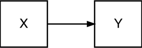{width="26%"}

:::

[Figure 2.1](#figure-2-1) shows a very simple DAG containing two variables, X and Y. This DAG encodes three beliefs: (1) that X has a causal effect on Y, as indicated by the presence of an arrow going from X to Y; (2) that Y does not have a causal effect on X, as indicated by the absence of an arrow going from Y to X (the graph is acyclic); and (3) that there are no variables which cause X *and* Y, as indicated by the absence of nodes with arrows going to X and Y -- on the convention, discussed below, that DAGs are drawn 'complete'.[^4]

A (frankly miraculous) property of DAGs is that beyond being conceptual models, DAGs obey a simple set of rules that entail empirical predictions: provided the DAG is complete -- that is, the common causes of any two variables in the DAG also appear in the DAG -- "open" paths (defined below) between variables permit statistical association, while their absence implies statistical independence. Implied independencies are testable and so some assumptions encoded in the DAG can be tested and refined by applying the DAG to real-world data.[^5] The DAG in [Figure 2.1](#figure-2-1) predicts that the variables X and Y should be correlated due to X having a causal effect on Y. Whether X and Y are correlated is testable, though a correlation could also arise because the DAG is mis-specified relative to the data it is applied to, either in principle (e.g., because Y causes X or X and Y share a common cause) or in practice (e.g., due to sample biases or measurement problems in the data).[^6]

::: {#figure-2-2}

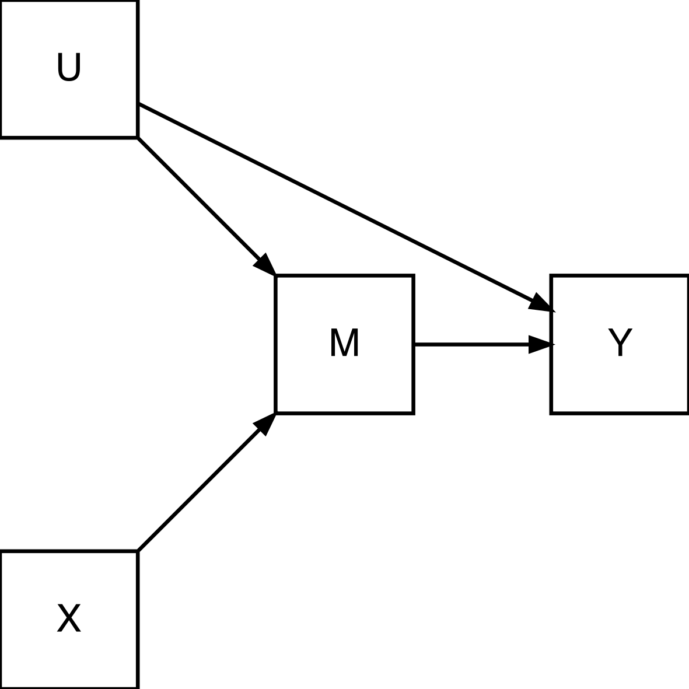{width="31%"}

:::

[Figure 2.2](#figure-2-2) shows a more complex DAG. There are now four variables (X, U, M, and Y) and six directed paths representing causal effects, some of which pass through intermediate variables: X → M, X → M → Y, M → Y, U → M, U → M → Y, and U → Y. M has a causal effect on Y that is not mediated by any other variable in the DAG (M → Y),[^7] X has a causal effect on Y that is fully mediated by M (X → M → Y), and U has a causal effect on Y that is only partly mediated by M (paths U → M → Y and U → Y). Each of these paths is said to be a 'causal' (or 'directed') path as each begins by following the arrows from the first variable onwards in the direction of causality.

Paths between variables do not necessarily proceed in the direction of causality, and association can travel along paths regardless of their direction. For instance, in [Figure 2.2](#figure-2-2), M will also be associated with Y via a 'backdoor' path through U (M ← U → Y); such a path is said to be backdoor because it exits the back of the initial variable (i.e., it begins by following an arrow *against* the direction of causality). The path is non-causal in the sense that it is not solely comprised of *descendants* (consequences) of the initial variable M, as indicated by the presence of arrows pointing in the opposite direction of causality (M ← U). This path therefore does not reflect a causal effect of M upon Y, but it nevertheless would lead to an observed association between M and Y that is introduced by their common cause (i.e., confounder), U. Controlling for this common cause would remove the association transmitted through the backdoor path.

More formally, in DAGs, paths between variables are either 'open' or 'closed' (*blocked*). Variables that are connected by an open path should be associated,[^8] while variables that are connected only by closed paths should not. Whether a path is open or closed depends on the variables being *conditioned* upon; conditioning can be explicit (e.g., through regression adjustment or stratification) or implicit (e.g., by analysing a dataset restricting to one or more levels of a relevant covariate, e.g., only those with response at each wave). Whether a path is open or closed can be determined by applying the four rules of d-Separation [@ref840]. These rules are shown below with accompanying DAGs. In these and other DAGs, we denote a variable that has been conditioned upon using red outline and grey fill.

**d-Separation Rules**

1.  If there are no variables being conditioned upon, a path is closed if and only if two arrowheads on the path *collide* at some variable on the path.

    - Below, the path X → Y ← U collides at Y (Y is referred to as a *collider*), and so, without conditioning upon Y, the path between X and U is closed.

::: {#figure-2-3}

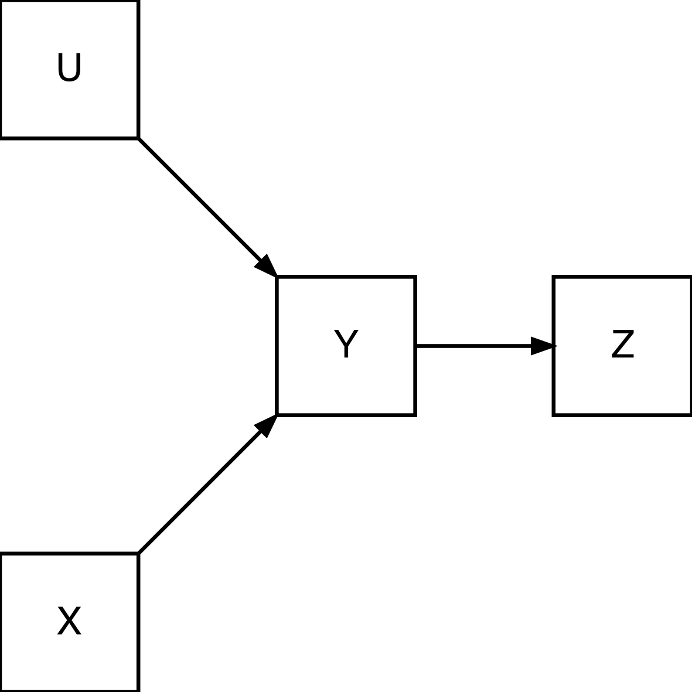{width="31%"}

:::

2.  Any path that contains a non-collider that has been conditioned upon is blocked.

    - Below, the paths (a) X → M → Y and (b) X ← U → Y are blocked by conditioning upon the non-colliders M and U, respectively.

::: {#figure-2-4}

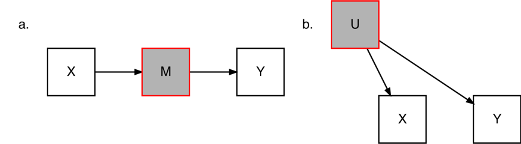{width="63%"}

:::

3.  A collider that has been conditioned upon does not block a path.

    - Below, the path X → Y ← U is open because the collider Y has been conditioned upon.

::: {#figure-2-5}

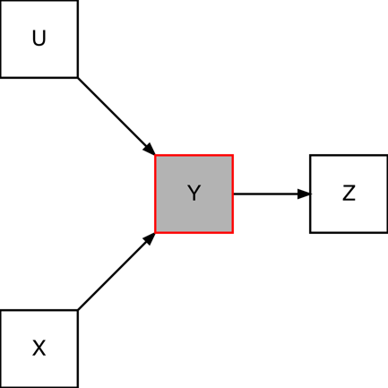{width="31%"}

:::

4.  A collider that has a descendant that has been conditioned upon does not block a path.

    - Below, the path X → Y ← U is open because Z, a descendant (consequence) of the collider Y, has been conditioned upon.

::: {#figure-2-6}

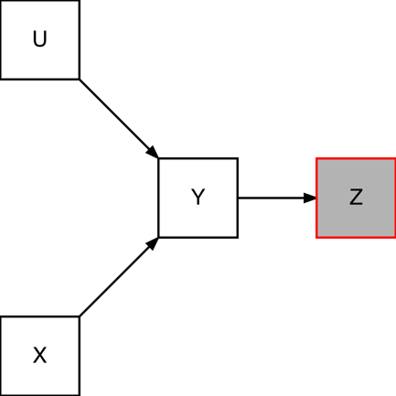{width="31%"}

:::

Applying these rules to [Figure 2.2](#figure-2-2), the path M ← U → Y is open but can be closed by conditioning on U. This path represents the belief that U is a confounder for the relationship between M and Y; we discuss confounding further below. X is also connected to Y via M and U (X → M ← U → Y). M is a descendant of both X and U and so is a collider on this path (the paths from X and U *collide* at M). The path X → M ← U → Y is therefore closed because neither M nor its descendant, Y, has been conditioned upon. An open collider path generates 'collider bias', a form of selection bias, examples of which abound and which can also affect RCTs. We discuss selection bias further below.

The benefit of drawing the DAG in [Figure 2.2](#figure-2-2) is threefold. First, it is a very compact and straightforward way of representing our beliefs about the causal relationships pertaining to a particular research question. The DAG succinctly communicates these beliefs to other researchers. Second, as noted, DAGs imply a set of empirical predictions that can enable us to test our beliefs. The DAG in [Figure 2.2](#figure-2-2) predicts, among other things, that (a) M should be associated with Y, either unconditionally or having conditioned upon U; (b) X should be associated with M and Y, but not with Y when conditioning upon M and U; (c) U should be associated with Y, either unconditionally or conditioning on M; and (d) X should be independent of U unless conditioning on M and/or Y. If we have data with measurements of X, M, Y and U, we should be able to test these predictions, i.e., evaluate the DAG-data consistency [@ref652].

Third, accepting the assumptions encoded in [Figure 2.2](#figure-2-2), we can use the DAG to understand the biases that may apply in an existing study or, better still, plan a new study that obtains an unbiased causal effect estimate even with observational data. For instance, to obtain an estimate of the causal effect of M on Y, we can condition upon U or use X as an instrument for M (more on this in [Section 5.9](05-09-instrumental-variables.qmd)). This is the power of DAGs.

### 2.2.3 Confounding Bias {#confounding-bias}

The three main sources of bias in observational studies can each be represented with DAGs. We have already seen an example of confounding in [Figure 2.2](#figure-2-2) -- U was a confounder of the relationship between M and Y (M ← U → Y).

::: {#figure-2-7}

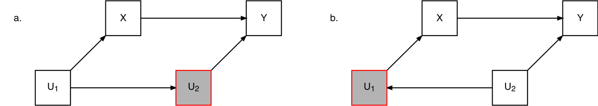{width="94%"}

:::

DAGs provide a distinct perspective on confounding. Specifically, the focus is on the bias itself, which is determined by the causal structure, rather than the role individual variables may have, which is the more usual focus [@ref840].[^9] Though confounders [common causes\; @ref442] of exposure and outcome may exist, whether there is confounding [bias]{.underline} depends on the variables that have been conditioned upon. For instance, in [Figure 2.7a](#figure-2-7), U~1~ is a confounder of the relationship between X and Y (X ← U~1~ → U~2~ → Y). Yet, there is no confounding bias because U~2~, which is not a common cause of X and Y but blocks the backdoor path between them (d-Separation Rule #2), *is* conditioned upon. A similar observation can be made for the DAG in [Figure 2.7b](#figure-2-7). [^10]

::: {#figure-2-8}

{width="91%"}

:::

Compare the structural definition with a lay, partly data-driven (and ultimately incorrect) definition of a confounder: a variable that is associated with X and Y (conditional on X) and is not on the causal path between X and Y. [Figure 2.8a](#figure-2-8) shows a variable Z that would meet this definition (conditioning on X opens the path Z → X ← U → Y) despite there being no confounding bias from Z (i.e., no path X ← Z → Y): no adjustment for Z needs to be made and not conditioning on Z does not mean only a biased estimate of the causal effect of X upon Y could be obtained. [Figure 2.8b](#figure-2-8) shows a variable C that would also meet the data-driven definition and yet controlling for C actually creates bias because it is a collider on the backdoor path between X and Y [this bias is referred to as M-bias\; @ref465]. Conditioning upon U~1~ and/or U~2~ would close this (now opened) path but conditioning on either is unnecessary unless C is conditioned upon.

We can draw two lessons from the DAGs in [Figure 2.7](#figure-2-7) and [Figure 2.8](#figure-2-8). First, as a confounder may only be one step on a longer causal path, it is possible to have multiple options to close biasing backdoor paths. Some may not be "common causes" of exposure and outcome -- e.g., according to the DAGs in [Figure 2.7](#figure-2-7), U~1~ could be conditioned upon, or U~2~ could, or both. Second, theory and domain-specific knowledge are required to make appropriate choices with regard to adjustment sets. "Causal Salad" approaches [@ref1782], where a host of potentially relevant variables are thrown roughshod into a regression model (e.g., C in [Figure 2.8b](#figure-2-8)), can make an analysis more biased than if no adjustments were made at all.

::: {#figure-2-9}

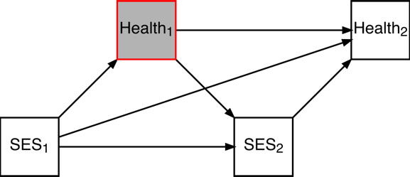{width="42%"}

:::

In [Figure 2.7](#figure-2-7) and [Figure 2.8](#figure-2-8), the exposure was a single point intervention, but many research questions relate to estimating joint effects of multiple exposures or the effect of an exposure varying over time -- for instance, questions related to testing models in life course epidemiology [@ref2864]. Where the causal effect of one exposure is mediated by a confounder of others, simple regression adjustment will not be able to identify the joint causal effect of the exposures combined, a problem known as *intermediate* confounding [@refgBdfcUY6_WXKrNfmS] or *time-dependent* or *time-varying* confounding in the longitudinal setting, specifically [@ref826; @ref21012]. [Figure 2.9](#figure-2-9) shows a DAG with an example demonstrating the issue: the effect of low socioeconomic status in both childhood and adolescence upon health [@ref21002]. When attempting to identify the joint effect of SES~1~ *and* SES~2~ upon Health~2~ (e.g., SES~1~, SES~2~ = Low, Low vs. High, High), it would be necessary to condition on Health~1~ to block the (confounding) backdoor path from SES~2~ to Health~2~ via Health~1~ (SES~2~ ← Health~1~ → Health~2~). However, this also blocks part of the causal effect of SES~1~ upon Health~2~ (SES~1~ → Health~1~ → Health~2~). Relatively complex statistical methods beyond simple regression adjustment are necessary in this setting and are described in [Sections 5.12](05-12-g-methods-for-time-varying-exposures.qmd) and [5.13](05-13-causal-mediation.qmd).

::: {#figure-2-10}

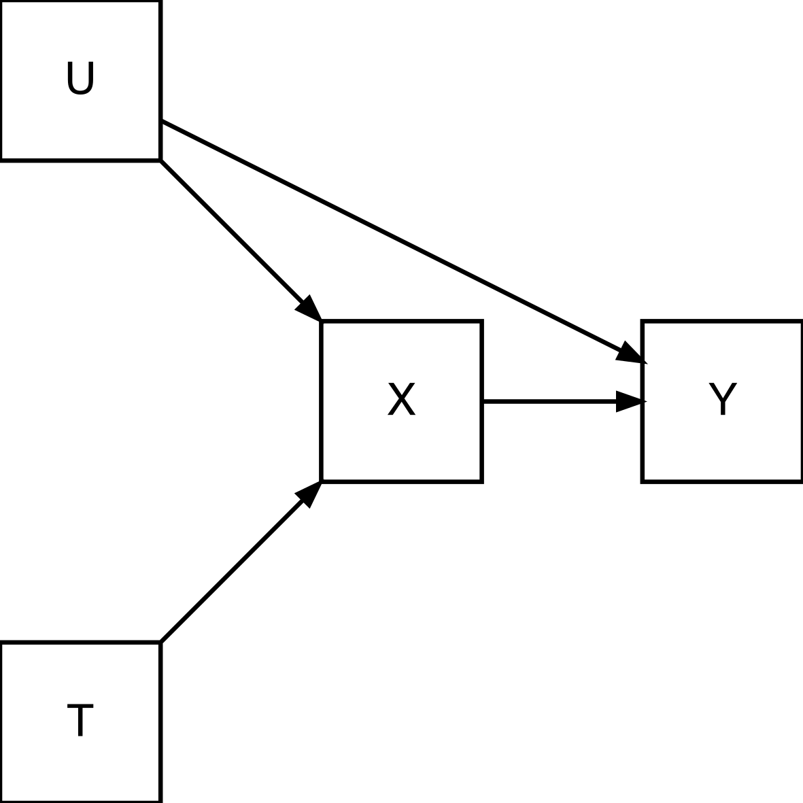{width="31%"}

:::

Before moving on to discuss the second threat to internal validity, selection bias, we can briefly show why RCTs are so powerful. [Figure 2.10](#figure-2-10) represents the RCT design within a DAG (note the similarity to [Figure 2.2](#figure-2-2)). In a standard RCT, individuals are randomised to treatment or control groups (denoted by T). This randomisation provides a source of variation in the exposure X that is not caused by any other causes of Y, including any confounders (U) of the relationship of X and Y that may exist in the population; that is, treatment is allocated independently of potential outcomes for Y. Given that the effect of T upon Y should only operate through its effect upon X, T can be used as an 'exposure' variable in its own right (as in an "Intention to Treat" analysis) or as an instrumental variable for X. The extraordinary feature of RCTs is that the researcher need not even know what confounders U are -- differences are not systematic and chance imbalances contribute to sampling variability.

### 2.2.4 Selection Bias {#selection-bias}

[Figure 2.8b](#figure-2-8) showed an example of M-bias. M-bias is, in fact, a form of selection bias as it arises from conditioning upon a collider. While most attention is usually placed on confounding as a source of bias in observational studies, selection bias can have greater consequences and be sufficient to generate estimates in the entirely opposite direction to the true causal effect. For example, during the COVID-19 pandemic, there was evidence that suggested smoking was protective against infection. However, as Tattan-Birch and colleagues [-@ref562] note, both smoking and COVID-19 infection make people cough more, which is a reason for getting tested. Among people tested for COVID-19, smoking may be negatively correlated with infection because smokers are more likely to be tested *despite* not having COVID-19 ([Figure 2.11](#figure-2-11)).

::: {#figure-2-11}

{width="31%"}

:::

Since being tested for COVID-19 is a potential consequence of both smoking and COVID-19, it can be conceptualised as a collider variable. As the analytic sample includes only tested individuals, this collider has been implicitly conditioned upon through the study design using restriction, instead of explicit analytical choice (e.g., by regression adjustment, as in the case of M-bias in [Figure 2.8b](#figure-2-8)). But regardless of whether conditioning is implicit or explicit, the consequences are the same: selection bias. This can -- and should -- be represented in a DAG to fully capture biasing processes [@ref6]. Note, the phrases 'selection' and 'selection bias' are not used consistently across the academic literature, which can cause confusion. [Box 2.1](#box-2-1) offers some clarifications.

::: {#box-2-1 .callout-note title="Box 2.1: Notes on selection bias terminology" icon=false}

The phrases 'selection' or 'selection bias' are not used consistently in all fields or by all academics. Some notes of clarification:

- Economists frequently use the phrase 'selection' (i.e., 'selection on unobservables'), but this is synonymous with confounding -- e.g., 'selection into unemployment based on human capital'.

- 'Selection bias' is often used to refer to issues of 'transportability' of an estimate to another population (i.e., bias in *external* rather than *internal* validity). This bias occurs when effects are heterogeneous and there are differences in the distribution of effect modifiers in the analytical sample relative to the target population. Lu et al. [[-@ref20999; -@ref6]]{.cite-suppressed} refer to this type of bias as 'Type 2' selection bias.

- Selection bias as we have used it in the paragraph above is alternatively referred to as 'collider stratification bias' and can be separated into 'collider restriction bias' and 'collider adjustment bias' [@ref20999; @ref6].

  - Collider restriction bias from selecting data points according to levels of a collider (e.g., only studying individuals with a COVID-19 test)

  - Collider adjustment bias arises from including colliders in a regression model (e.g., as in the M-bias example in Figure 2.8b).

- Though collider adjustment bias is often considered a form of 'selection bias', Lu et al. [-@ref6] argue against this as it does not involve selecting only some data points for analysis, instead referring to it as a form of 'overadjustment' bias.[^11] However, we use 'selection bias' to capture both forms of collider bias, given this remains in predominant use.

:::

Selection biases are particularly important to consider in cohort studies due to the possibility of sweep and item non-response. While the initial sample in each of CLS's cohorts was designed (after applying design weights) to be nationally representative, there has been non-random attrition from each study over time [@ref462; @ref461; @ref463]. The length and depth of the survey questionnaires also mean that some items have less than complete response. Accordingly, analysing only complete cases can mean restricting the sample and implicitly conditioning on colliders, similar to [Figure 2.11](#figure-2-11). In [Section 5](05-methods.qmd), we discuss methods to address these problems, but unaccounted for, non-response can lead to selection bias. Selection bias also has further salience in mediation analyses, which are commonly applied to cohort data because of their longitudinal nature. These analyses are often used when a researcher is interested in decomposing a total causal effect into direct (unmediated) and indirect (mediated) effects, e.g., as in a Baron and Kenny [-@ref464] type analysis.

::: {#figure-2-12}

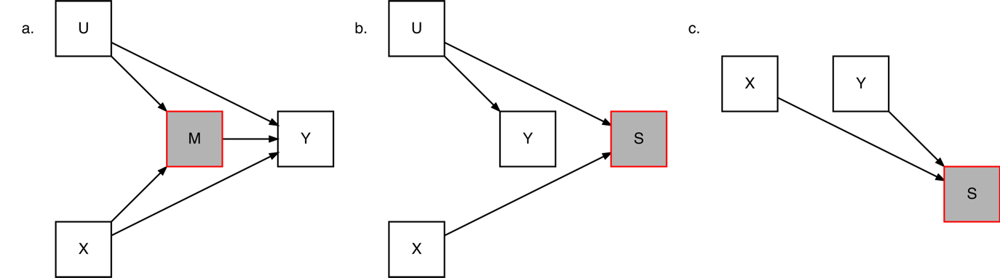{width="100%"}

:::

These issues (differential non-response and adjusting for a mediator) are represented graphically in [Figure 2.12](#figure-2-12). [Figure 2.12a](#figure-2-12) shows a typical mediation analysis where a mediator is explicitly conditioned upon in an attempt to obtain an estimate of a direct causal effect (X → Y). Controlling for M opens the path from X to Y via M and U (X → M ← U → Y). A researcher wanting to obtain an unbiased estimate of the direct (or indirect) effect of X upon Y will not do so using this analysis unless they also condition on U. Note though, here U stands in for *all* variables independently affecting M and Y, so controlling for U may be a difficult task indeed. The size of the bias is determined by the strength of the path X → M ← U → Y -- i.e., the size of the effect X and U have on M and the size of the effect U has on Y.[^12]

[Figure 2.12b-c](#figure-2-12) represent two situations where selection into the analytical sample is related to exposure and outcome. Because we can only analyse the data that are available, in both cases, a spurious association is introduced between the two. We have already noted that this may arise due to issues with the data collection process -- for instance, if we have unit, sweep or item non-response -- but it can also arise for substantive reasons: we only observe people who are alive and we may observe a variable for some individuals because it is only defined for a certain group (e.g., wages are only defined for the employed). This can have important ramifications. For instance, at older ages smoking is associated with a *lower* risk of dementia, but this is likely due to the onset of dementia occurring late in life after many heavy smokers have died [@ref840]; surviving smokers are relatively robust compared to the larger proportion of surviving non-smokers but not *because* they smoke.

Before moving on to discuss the third threat to internal validity, information bias, we note that selection bias can also affect RCTs for the same reason as observational studies. Selection bias would, for instance, arise where there is attrition from the trial that is related to both treatment and the outcome. Selection bias can also arise in mediation analyses as conditioning upon a consequence of an exposure leads to incomparable groups. To give an example: imagine an RCT in which participants were randomised to a work placement scheme (treatment) or no intervention (control). We may be interested in the long-term effect of work placement on wages, but wages are only observed for those with a job. If the work placement scheme increases employment, then the employed individuals in the treatment group will include not only those who would have found a job anyway, but also those who are only employed because of the scheme. By contrast, the employed individuals in the control group will only include those able to find a job without the scheme. If the additional employed individuals in the treatment group tend to earn lower wages, a naïve comparison of wages among those employed will underestimate the effect of the scheme on wages. See [Table 2.1](#table-2-1).

::: {#table-2-1}

```{=html}
<table class="table table-bordered rct-table">
<caption><strong>Table 2.1:</strong> A hypothetical RCT of a job placement scheme that improves employment and wages, but wages are only observed among employed individuals (grey shaded cells) leading to a naïve analysis suggesting the intervention was associated with lower wages, when the causal effect was the opposite.</caption>
<thead>
<tr><th colspan="2" rowspan="2"></th><th colspan="2">Trial Arm</th><th rowspan="2"></th></tr>
<tr><th>Work Placement</th><th>Control</th></tr>
</thead>
<tbody>
<tr><th rowspan="2" class="text-end">Employability</th><th class="text-end">High</th><td class="shaded">£600 p.w.</td><td class="shaded">£550 p.w.</td><td></td></tr>
<tr><th class="text-end">Low</th><td class="shaded">£400 p.w.</td><td>£350 p.w. (Latent)</td><td></td></tr>
<tr class="summary"><th colspan="2" class="text-end">Observed Mean</th><td>£500 p.w.</td><td>£550 p.w.</td><td>− £50 p.w.</td></tr>
<tr class="summary"><th colspan="2" class="text-end">True Mean</th><td>£500 p.w.</td><td>£450 p.w.</td><td>+ £50 p.w.</td></tr>
</tbody>
</table>
```

:::

### 2.2.5 Information Bias {#information-bias}

::: {#figure-2-13}

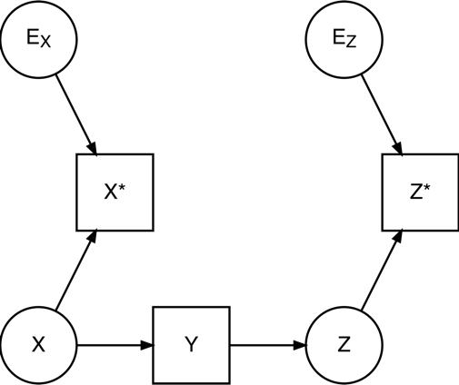{width="37%"}

:::

The third threat to internal validity is information bias. Information bias arises when measured variables are not perfect representations of the phenomena they are designed to capture -- i.e., when variables are measured with error. In DAGs, measurement error is represented by distinguishing the measured variable (X\*) from the latent, unobserved variable (X) and drawing the measured variable as a descendant of the latent variable and an error node (E~X~). Nodes for latent variables and unobserved errors are displayed as circles or ellipses. See [Figure 2.13](#figure-2-13) for an example.

Errors can be classified along two dimensions: they can be *dependent* or *independent* and *differential* or *non-differential*. An error is dependent (as opposed to independent) if it is correlated with the measurement error of another variable. An error is differential (as opposed to non-differential) if its value is related to the underlying value of a variable. [Figure 2.13](#figure-2-13) displays a situation where there are independent and non-differential errors in two study variables, X\* and Z\*; classical measurement error is a type of independent, non-differential measurement error.

Whether independent, non-differential error leads to a biased estimate of a causal effect depends on the analysis. In a simple linear regression with classical (additive) measurement error in the exposure (X\* = X + E~x~), the coefficient on the exposure will be biased towards the null. Intuitively, this is because each unit increase in X\* can be either caused by X, which has an effect on Y, or E~x~, which does not. This phenomenon is known as regression dilution [@ref1416]. On the other hand, if it is the outcome that is measured with classical measurement error (Y\* = Y + E~Y~), there would be no bias, but statistical precision will be decreased.

::: {#figure-2-14}

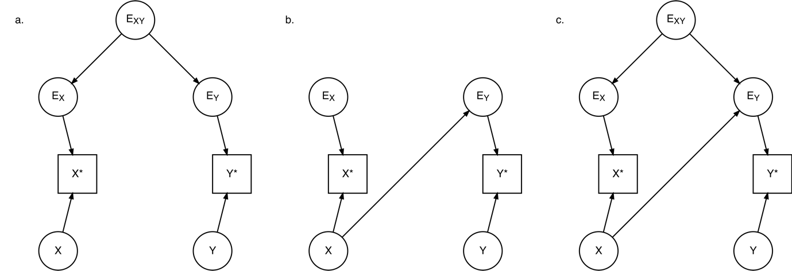{width="100%"}

:::

[Figure 2.14](#figure-2-14) completes the three other combinations of dependent/independent and differential/non-differential error. In each case, X does not have a causal effect on Y but X\* and Y\* are associated due to measurement error. [Figure 2.14a](#figure-2-14) displays a situation where there are dependent, non-differential errors in the two measured variables, X\* and Y\*. X\* and Y\* are associated via the backdoor path X\* ← E~X~ ← E~XY~ → U~Y~ → Y\*, even though there is no causal effect of the latent variable X on Y. [Figure 2.14b](#figure-2-14) displays a situation where there are independent, differential errors in two measured variables X\* and Y\* (Y\* is differential with respect to X). X\* and Y\* are associated via the path X\* ← X → E~Y~ → Y\*, even though there is no causal effect of X on Y. [Figure 2.14c](#figure-2-14) displays a situation where there are dependent, differential errors in two measured variables X\* and Y\* (Y\* is differential with respect to X). X\* and Y\* are associated via the two biasing paths in [Figure 2.14a-b](#figure-2-14) even though there is no causal effect of X on Y: X\* ← X → E~Y~ → Y\* and X\* ← E~X~ ← E~XY~ → E~Y~ → Y\*.

::: {#figure-2-15}

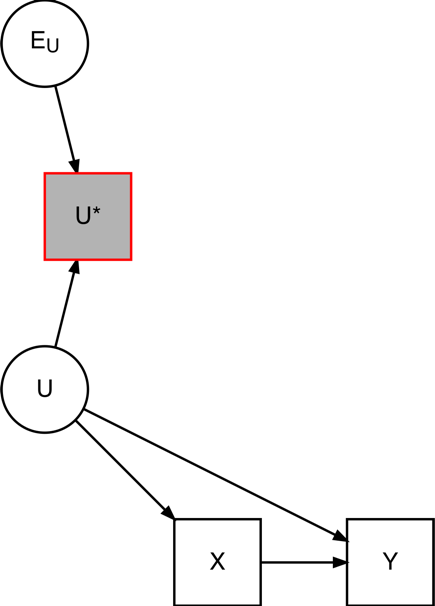{width="32%"}

:::

Information bias is not only a problem where exposure and outcome variables are subject to measurement error but also when there is measurement error in variables used to close biasing paths. [Figure 2.15](#figure-2-15) displays a common situation where the confounder U is measured with some error. Since U\* is not a perfect measure of U, conditioning on U\* will not close the backdoor path X ← U → Y completely, leaving residual confounding. Thus, the effect of X on Y is still confounded, though the size of the resulting bias depends on the relative size of the error in U\* and the strength of the confounding pathway. The more accurate the measurement, the less bias; the stronger the confounding, the greater the bias.

A potential source of information bias that users of CLS's data should be particularly aware of is *survey mode effects*. Each of CLS's cohort studies has at various points adopted mixed-mode designs, with cohort members responding via, e.g., web, video, telephone or face-to-face interview. Mixed-mode designs mean survey modes differ between individuals *within a sweep* or within individuals *across sweeps*. Mixed-mode designs can increase response rates while also lowering the cost of data collection. A drawback, though, is that responses to survey items can differ systematically between modes, in particular due to differences in interviewer presence/absence and in how items are presented [@ref58]. For instance, a participant may be less willing to answer sensitive questions accurately in non-anonymous modes. Differences between modes due to how items are measured are termed mode effects.

::: {#figure-2-16}

{width="58%"}

:::

Unaccounted for, mode effects can cause bias in analysis because mode effects are mechanistically dependent; two variables subject to mode effects will be associated where mode is shared ([Figure 2.16a](#figure-2-16); X\* ← M → Y\*) or correlated. But mode effects can also cause bias in analysis due to mode effects being differential ([Figure 2.16b](#figure-2-16); X → M → Y\*); in mixed-mode designs, participants are typically not randomised to mode, and the characteristics of participants in each mode can differ due to active participant choice or as a direct or indirect consequence of the fieldwork design. For instance, people without a telephone number may only be offered face-to-face interview, while in the sequential mixed-mode design where one mode is only offered after non-response to previously offered modes, groups who are slower to respond will only appear in modes offered last. Systematic differences between modes due to *who* is being measured are referred to as *mode selection*.

In the DAGs in [Figure 2.16](#figure-2-16), bias can be removed by conditioning upon mode (e.g., by including mode as an indicator variable in a regression model). However, conditioning upon mode can generate collider bias where there are unaccounted-for factors that also determine selection into mode (X → M ← U → Y, [Figure 2.17a](#figure-2-17)), a Gordian Knot-like problem when the unobserved factors are the latent variables of interest themselves (X → M ← Y, [Figure 2.17b](#figure-2-17)).

::: {#figure-2-17}

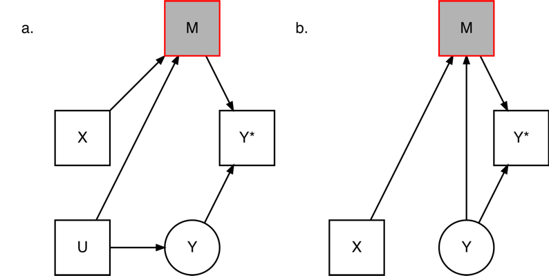{width="58%"}

:::

CLS has recently released guidance for users of its cohort data on handling mode effects [@ref632]. This guidance includes a description of the mixed-mode elements in each cohort, DAGs to conceptualise a wider set of situations in which mode effects can bias analysis, and discussion of methods for accounting for mode effects [see also @ref4; @ref20972].

### 2.2.6 Researcher Degrees of Freedom {#researcher-degrees-of-freedom}

In the previous three sections we have seen how bias can arise from analytical decisions and the data-generating process, but bias can also arise when researchers (or editors or publishers) choose which results to publish. Many analyses admit multiple defensible specifications (e.g., how to treat missing data, how to operationalise key variables), which may give slightly different results, some more favourable to the researcher's aims or prejudices, some less. If the analyst spends their "researcher degrees of freedom" [@ref153] on getting the answer they want, absence of confounding, selection, and information biases is no guarantee of obtaining an unbiased causal effect. This problem can be lessened through pre-registration of analysis plans, including using registered report publication models [@ref21068; @ref5266]. Methods that involve running and presenting the "universe" of defensible model specifications, such as Specification Curve Analysis [@ref151] or Multiverse Analysis [@ref107], can also help. See Orben & Przybylski [-@ref2057] for an example of specification curve analysis using MCS data.

## 2.3 Why Cohort Studies? {#why-cohort-studies}

Given the empirical and theoretical expectation of the potential for bias in cohort and other observational studies (see [Section 8](08-appendix.qmd) \[Appendix\] for a review), readers may wonder why cohort studies should be used at all. Besides highlighting the utility of cohort studies for purely descriptive analyses, a typical defence would note that there is little other option -- RCTs are expensive, potentially unethical, and in many cases impractical or even impossible. Large cohort studies, on the other hand, can be used for very many different research questions, at relatively low cost, exist already so can give answers fast, and by measuring behaviours and other factors occurring anyway (e.g., problematic drug use) do not have the same ethical issues that can arise in RCTs.

But this is a negative case. More positively, there are situations that are recorded in observational data where confounding and other forms of bias are unlikely to exist or to materially impact results, including "natural" experiments. There are also frameworks and methods that have been developed which, when used in appropriate situations, can help researchers draw sensible causal inferences from observational data. Methods also exist for detecting and correcting for bias *post hoc*, and in many important cases the size or direction of bias will not be sufficient to substantively affect results. Compelling causal claims can therefore still be made with observational data even when bias is present and known. In [Section 4](04-attributes.qmd), we further discuss the attributes of cohort data that support causal inference, and in [Section 5](05-methods.qmd), we describe methods that exploit these attributes.

[^1]: Some other methods, such as difference-in-differences, instrumental variables, and the regression discontinuity design, use different identifying arguments, though each include a version of conditional exchangeability. These assumptions are stated in [Section 5](05-methods.qmd) when relevant. Note, these assumptions also apply when targeting other estimands, including the Average Treatment Effect on the Treated (ATT) and the Average Treatment Effect on the Untreated (ATU).

[^2]: Some methods, such as the Sharp Regression Discontinuity Design ([Section 5.10](05-10-regression-discontinuity-designs.qmd)), do not rely upon the positivity assumption as they instead use statistical models or other assumptions to extrapolate counterfactual estimates.

[^3]: The consistency assumption can be highly restrictive given treatments can vary along many different dimensions [e.g., the angle at which a vaccine is administered\; @ref1248]. In practice, it may not be possible to determine which aspects of different versions of a treatment are irrelevant for (potential) outcomes, and thus if consistency is met. Domain specific expertise is necessary to make these judgements, but is therefore limited by present knowledge [@ref826]. Given it may be impossible to completely specify a consistent treatment, observed outcomes could be considered a weighted average of the different versions of treatment captured in a definition ("10% weight loss via calorific restriction"). Bias can arise where there are (possibly) subtle differences in distribution of these treatments between treatment and control groups, even where conditional exchangeability has been achieved. Note treatment variation is one reason results from one population may not generalise to another [@ref826].

[^4]: Note it is possible to include in a DAG factors that have causal effects on one another. This is handled by treating variables as time-specific to respect temporality -- e.g., X~t~ → Y~t+1~ → X~t+2~

[^5]: DAGs were initially developed by Judea Pearl, a computer scientist interested in artificial intelligence. As DAGs follow rules, a property is that they can be programmed and manipulated algorithmically. The software DAGitty (<https://www.dagitty.net/>) can be used to draw DAGs and can also generate the set of testable predictions (i.e., \[conditional\] independencies) implied by a DAG. Note, (conditional) independencies, which represent the [absence]{.underline} of a path, represent stronger assumptions than dependencies, which could result from any number of paths (possibly of different directions, too).

[^6]: The distinction between principle and practice is not clear cut because, as we shall see, DAGs can be drawn to represent data issues and DAGs are most useful when drawn for the data they are applied to.

[^7]: This is not to say the effect on M on Y is unmediated by any other variable (e.g., a biological mechanism operating at the cellular level). Recall, a DAG is complete if common causes of any two variables in the DAG also appear in the DAG. Mediators therefore only need to be included in a DAG if they cause, or are caused by, two variables in the DAG, though they may be optionally specified if of analytic interest.

[^8]: An exception is when paths counterbalance. High winds can blow boats off course, but a good captain handling the tiller may keep the boat's bearing [@ref451]. Note, as DAGs are non-parametric, statistical relationships may be of a form that simple (e.g., Pearson's) correlations cannot detect.

[^9]: For more on variable roles within DAGs, see Tennant et al. [-@ref442].

[^10]: In Footnote 8, we discussed how DAGs can be high level and do not necessarily have to include all mediators of a causal effect from one variable to another within them (for instance, a DAG representing the effect of education on health might not include a node for income). Given this, we should note that confounders of the relationship between an exposure and a mediator also confound associations between exposures and outcomes [@ref52].

[^11]: Other examples of overadjustment bias are conditioning on instrumental variables (see [Section 5.9](05-09-instrumental-variables.qmd)), mediators (where one wishes to estimate a total, rather than indirect, effect), or consequences (descendants) of an outcome [@ref52; @ref21001; @ref5465]

[^12]: This provides a straightforward solution to the so-called "obesity paradox" of obese individuals displaying greater survival rates from cardiovascular disease [CVD\; @ref8]. As CVD is a consequence of obesity, comparing survival rates among obese and non-obese individuals with CVD compares obese people against those who must have developed CVD for other reasons, some of which may have far worse prognoses, even if obesity itself is deleterious for health.
