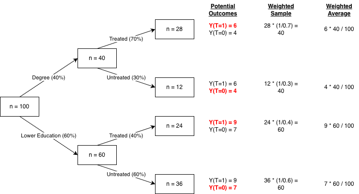

# 5.3 Inverse Probability of Treatment Weighting {#inverse-probability-of-treatment-weighting}

## 5.3.1 Method {#method}

[Section 5.2](05-02-matching.qmd) discussed issues with using propensity scores to match treatment and control groups. Regardless of this problem, when used as a covariate or to weight observations, propensity scores can recover causal effects: the propensity score theorem [@ref20816] shows that if treatment is independent of potential outcomes conditional on covariates, U, then treatment will also be independent of potential outcomes conditional on the propensity score (the probability of treatment conditional on the same covariates). Intuitively, where a binary exposure is influenced non-deterministically, confounders can be thought to influence the *probability* of an exposure occurring, rather than the exposure itself. Conditioning upon the propensity score thus closes a backdoor path. See [Figure 5.3](#figure-5-3) for a DAG.

::: {#figure-5-3}

![**Figure 5.3:** DAG representing conditioning on the propensity score [adapted from @ref451].](images/image20.png){width="31%"}

:::

The typical way of using a propensity score is as a weight in Inverse Probability of Treatment Weighting (IPTW). In IPTW, treated observations are weighted by the inverse of their probability of treatment and untreated units are weighted by the inverse of their probability of non-treatment (i.e., 1 -- treatment). The upshot is that, when implemented successfully, data are reweighted to create a pseudo-population in which treatment assignment is independent of the measured confounders, thereby mimicking a feature of randomisation. The schematic in [Figure 5.4](#figure-5-4) displays the procedure where there is a single confounder, education, that is associated with both the probability of treatment and potential outcomes.

::: {#figure-5-4}

{width="100%"}

:::

In [Figure 5.4](#figure-5-4), a naïve comparison of treated and untreated groups would yield a downwards biased estimate due to the disproportionate number of treated individuals who are degree-educated and who have lower potential outcomes than those with less education -- i.e., the naïve comparison is 1.13 = (6\*28 + 9\*24)/52 -- (4\*12 + 7\*36)/48, instead of the correct causal effect, which is 2 (compare the potential outcomes Y\[T = 1\] and Y\[T = 0\] in each group). Using IPTW recovers the true causal effect as, when weighted, both treated and untreated groups contribute the initial sample size of the groups they were drawn from (i.e., n = 40 for those with a degree, n = 60 for those without): 2 = (6\*28\*1/0.7 + 9\*24\*1/0.4)/100 - (4\*12\*1/0.3 + 7\*36\*1/0.6)/100. This example generalises to scenarios where the propensity score is based on more than one covariate.

Inverse probability weighting (IPW) can also be used to account for bias from non-response, where responding units are weighted to reflect their respective frequency in the target population (i.e., their probability of response or selection). We discuss IPW for missing data further in [Section 5.4](05-04-missing-data-methods.qmd). Note, as with other 'non-equivalent groups design' methods, IPTW will provide unbiased estimates only in so far as control variables are sufficient to close backdoor confounding paths. Another issue that can arise with IPTW is where there are extreme weights, most typically where some treated units have very low probabilities of treatment and/or control units have very high probabilities of treatment. In this case, trimming is often used, either by winsorising (capping) particularly large weights or by dropping observations with extreme weights or propensity scores. As with matching, discarding observations or winsorising weights can, in some cases, shift the population for whom the effect is being estimated, by focusing on those within the region of common support. Typically, this is an unintended side effect of trimming, in which case the resulting estimate may no longer answer the original research question and may be challenging to interpret. That said, the effect in the overlap region can sometimes answer policy-relevant questions and therefore may still be of interest (e.g., if one does not expect treatment effect heterogeneity).

## 5.3.2 Applications {#applications}

Madia et al. [-@ref21043] use data from Next Steps to estimate the causal effect of school exclusion on labour market outcomes. They use several analytical approaches to address different sources of confounding, including school fixed effects ([Section 5.5](05-05-longitudinal-fixed-effects.qmd)), matching ([Section 5.2](05-02-matching.qmd)) and IPTW, with IPTW used to address statistical power issues with matching given the small number of treated individuals (i.e., persons permanently excluded from schools; N = 86). IPTW estimates show sizeable effects upon several outcomes, including higher risks of being not in employment, education, or training (NEET) or unemployed, specifically. Estimates are similar in size to those obtained using propensity score matching, but are more statistically precise as no observations are discarded.

The authors condition on multiple factors, exploiting Next Steps' rich data collection on individual characteristics and the family environment, and apply non-response weights alongside the IPTW weights to account for attrition. However, they are unable to control for prior educational attainment or detailed measures of cognitive and non-cognitive skills, which plausibly confound associations. The authors pay attention to the *consistency* assumption, comparing individuals who have been excluded with those who have never been suspended or excluded (though, an alternate, policy-relevant option could have been to compare excluded individuals with those only suspended). Finally, the authors use quantitative bias analysis (QBA) methods (Mantel-Haenszel and Rosenbaum bounds) to assess sensitivity to unobserved confounding. Two omissions are that no diagnostics for the weights are reported and the plausibility of the estimates given the QBA results is not discussed.

## 5.3.3 Opportunities {#opportunities}

Similar to matching and statistical adjustment, there are ample opportunities in CLS's cohorts to apply IPTW methods given the number of plausible confounders that can be included in IPTW models. Additionally, the longitudinal nature of the cohorts enables the creation of plausible non-response weights, as discussed in the next section.
