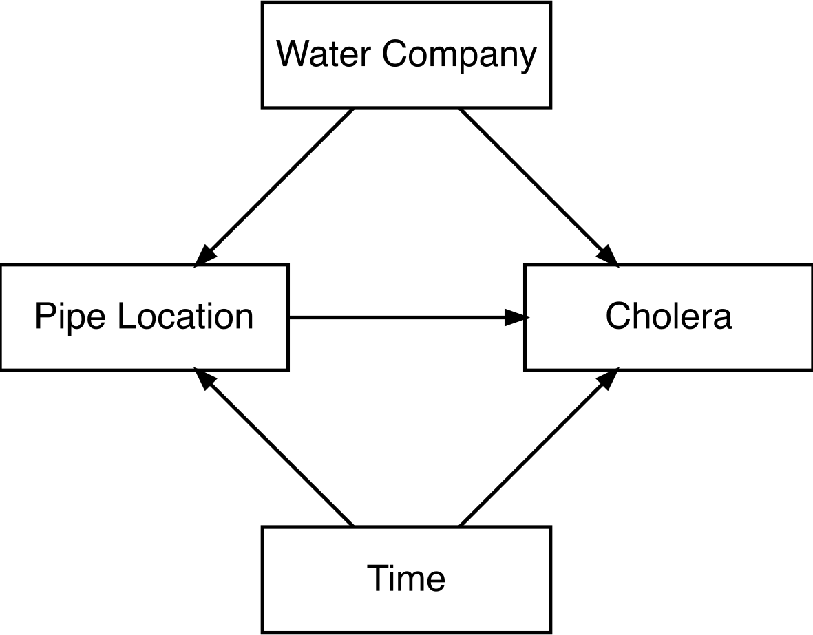

# 5.6 Difference in Differences {#difference-in-differences}

## 5.6.1 Method {#method}

In [Section 3.3](03-approaches.qmd#elaborate-theories), we introduced some of the evidence that John Snow marshalled to demonstrate that cholera was transmitted via faecal-infected water rather than miasmas. This was not the only evidence he brought to bear. A further piece of evidence was his "Grand Experiment", comparing cholera cases in households supplied by either of two London water companies, the Southwark-Vauxhall Company and the Lambeth Waterworks Company. Both companies drew water from the River Thames, but in 1852, Lambeth moved its intake pipes upstream of the main location where sewage was discharged (Cunningham, 2021). Cholera cases in households supplied by the two companies in two years, before and after Lambeth relocated its pipes, are shown in Columns 2-3 of [Table 5.2](#table-5-2).

::: {#table-5-2}

+------------------------+---------------------------------+-----------------------------------------------------------------------------------------------+
| **Water Company**      | **Cholera Incidence**           | **Decomposition**                                                                             |
|                        +----------+----------+-----------+--------------------+---------------------------------------------+----------------------------+
|                        | **1849** | **1854** | **Diff.** | **t~1~**           | **t~2~**                                    | **Diff.**                  |
+=======================:+:========:+:========:+:=========:+:==================:+:===========================================:+:==========================:+
| **Southwark-Vauxhall** | **135**  | **147**  | +12       | $u_{SV}$           | $u_{SV} + t_{SV}$                           | $t_{SV}$                   |
+------------------------+----------+----------+-----------+--------------------+---------------------------------------------+----------------------------+
| **Lambeth**            | **85**   | **19**   | *-66*     | $u_{L}$            | $u_{L} + d_{L} + t_{L}$                     | $d_{L} + t_{L}$            |
+------------------------+----------+----------+-----------+--------------------+---------------------------------------------+----------------------------+
| **Diff.**              | -50      | *-128*   | **-78**   | $u_{L} - u_{SV}$   | $u_{L} + d_{L} + t_{L} - u_{SV} - t_{SV}$   | $d_{L} + t_{L} - t_{SV}$   |
+------------------------+----------+----------+-----------+--------------------+---------------------------------------------+----------------------------+

: **Table 5.2:** John Snow's 'Grand Experiment' comparing cholera incidence (per 100,000) in households supplied by two water companies across two years (Cunningham, 2021).

:::

Multiple comparisons are possible with these data to try to determine the causal effect of Lambeth Waterworks Company's decision to move the pipe up the River Thames (and serendipitously reduce customers' exposure to cholera-infected water; Huntington-Klein, 2022). One can treat Southwark-Vauxhall as a control group and use the data cross-sectionally, comparing rates in 1854 between the two companies (19 - 147 = -128). Alternatively, one can treat the data as an event study and make a simple before-and-after (pre-post) comparison, looking at incidence in Lambeth before and after it moved the pipes (19 - 85 = -66). However, these rely on a number of assumptions, which the decomposition in Columns 5-7 of [Table 5.2](#table-5-2) clarifies. In those columns, the observed incidence is decomposed into a water company fixed effect ($u_{WC}$) which contributes regardless of time period, a water-company time effect (trend; $t_{WC}$) which contributes to the change between 1849 and 1854, regardless of whether the water company's pipes were moved, and a treatment effect ($d_{WC}$) which affects outcomes if 'treated' -- i.e., the water pipes have been moved. $d_{L}$ -- the treatment effect of moving the pipe for Lambeth-supplied households -- is the quantity (causal effect) of interest.

Cross-sectionally, the observed difference between Lambeth and Southwark-Vauxhall in 1854 is a function of the treatment effect, but also the time effects and fixed effects ($d_{L} + u_{L} + t_{L} - u_{SV} - t_{SV}$; Column 6, Row 3). Intertemporally, the observed difference is a function of the treatment effect and the time effect -- i.e., it is confounded by time differences that would have occurred anyway ($d_{L} + t_{L}$; Column 7, Row 2). A DAG representing Snow's Grand Experiment is displayed in [Figure 5.7](#figure-5-7).

::: {#figure-5-7}

{width="40%"}

:::

[Table 5.2](#table-5-2) shows that a further comparison is possible: the difference in differences over time between treated (Lambeth) and untreated (Southwark-Vauxhall) units (-66 - 12 = -78). The decomposition shows that this is a function of the treatment effect and the difference in the time trends in Lambeth and Southwark-Vauxhall ($d_{L} + t_{L} - t_{SV}$). This is the (2x2) Difference-in-Differences (DiD) estimator. [^23] It is unbiased where the time-trends in treated and untreated units are the same (i.e., $t_{L} - t_{SV} = 0$); that is, the counterfactual time-trend is the same regardless of treatment assignment. Here, that means Lambeth's cholera incidence in 1854 would have been 12 units higher than its 1849 level -- 97 per 100,000 -- had it not moved the pipe upriver. This is known as the 'parallel trends assumption'.[^24]

The quantity DiD recovers is the average treatment effect on the treated (ATT) -- the effect among units that actually received treatment over the periods observed -- rather than the average treatment effect (ATE) for the population as a whole ([Section 2.2.1](02-problem.qmd#what-is-a-causal-effect-counterfactuals-and-the-potential-outcomes-framework)). The purpose of the DiD estimate is to use within-variation in treated and control groups to condition on unit and time, simultaneously (i.e., blocking Pipe Location ← Time → Cholera and Pipe Location ← Water Company → Cholera in [Figure 5.7](#figure-5-7)). The basic 2x2 DiD empirical set-up is:

$$Y_{it} = \beta_{0} + {\beta_{1} \cdot Treat}_{i} + {\beta_{2} \cdot Post}_{t} + {\beta_{3} \cdot Treat}_{i} \cdot {Post}_{t} + \varepsilon_{it}$$

Where ${Treat}_{i}$ is an indicator for whether the observation is treated at any point and ${Post}_{t}$ is an indicator for whether the observation falls in the period after the treated unit was treated. The coefficient $\beta_{3}$, which is the unique difference post-treatment in the treated group, represents the causal effect of treatment (subject to the parallel trends assumption). In practice, a regression model may also include control variables that make the parallel trends assumption more plausible or could be paired with matching to identify plausible comparator observations.[^25]

As the parallel trends assumption relates to counterfactual outcomes (how the outcome would have changed over time in the treated group, absent treatment), it cannot be verified (Cunningham, 2021). However, in settings where more pre-treatment data are available, it is possible to perform two types of placebo test to at least explore the plausibility of the assumption. First, one can assess empirically whether trends were parallel in this pre-treatment period (e.g., one might assess whether changes across 1844-1849 were the same in Lambeth and Southwark-Vauxhall). Second, one can use placebo treatment dates to assess whether non-zero 'treatment' effects are observed (e.g., one could use data from 1839 and 1844 and pretend that the pipe was moved in 1844).

Though violations of either of these tests do not necessarily disprove the parallel trends assumption is correct (given the assumption relates to trends in the post-treatment period, specifically), they may provide some cause for concern. However, one should also consider the degree to which the assumption would need to be violated to overturn results (i.e., taking a quantitative bias analysis approach; Rambachan & Roth, 2023). Further, including extra untreated comparator groups similarly violating the parallel trends assumptions can sometimes still identify causal effects. For instance, to estimate the effect of government provision of emergency birth control on teen pregnancy rates using local authority (LA) level data, Girma & Paton (2011) use pregnancy rates among older women as extra controls (difference-in-difference-in-differences) on the assumption that these share similar within-LA time trends to younger women.[^26] See Cunningham (2021) for a decomposition of the 'triple-difference' design.

Parallel trends can be violated for several reasons, in addition to treated and untreated groups evolving separately. One reason is changes in composition in the groups over time (e.g., if Southwark-supplied households moved to Lambeth-supplied houses). A specific issue in cohort data is where there is non-random attrition. Another issue is anticipatory effects, a type of reverse causality, where the promise of treatment in future affects pre-treatment outcomes (e.g., fear of future job loss could affect present wellbeing). Finally, the assumption of parallel trends is dependent on the scale of the outcome; it may, for instance, hold on the natural (linear) scale but not on the log (percentage) scale, or vice versa.

In cohort data, more than two time periods may be available. In this case, the set of time and unit fixed effects can be added to the regression model -- including both time and unit fixed effects in a model is referred to as the two-way fixed effects (TWFE) estimator, and is an extension of the standard fixed effects estimator seen in [Section 5.5](05-05-longitudinal-fixed-effects.qmd). Having data from more than two time periods can also enable one to assess treatment effect dynamics -- i.e., how the differences between treated and untreated groups develop over time. For example, by adding further interaction terms between group and time dummies or modelling time trends in each group parametrically (e.g., with linear terms). This is useful where causal effects depend on length of exposure (e.g., long-term unemployment vs. short-term unemployment). Note, when using repeated data from the same observational units (i.e., cohort members), care must be taken to ensure standard errors reflect potential interdependencies (e.g., by using clustered standard errors).

In many settings, including in cohort data, the 'event' may occur at different times for different people (e.g., due to a policy being rolled out to different areas over time or people experiencing an event \[e.g., unemployment\] at different ages). This creates issues where treatment effects vary over time. To see this, imagine we have three groups: never treated, early treated, and late treated. With these data, there are four 2x2 DiD comparisons, which would be captured by a standard DiD estimator: early treated vs. never treated; late treated vs. never treated; early treated vs. late treated in the early post-treatment period; late treated vs. early treated in the late post-treatment period. [Table 5.3](#table-5-3) decomposes the DiD estimator for the late treated vs. early treated comparison, which causes the issue. Now the difference in the differences is $d_{L} + t_{L} - t_{E} - {\mathrm{\Delta}d}_{E}$ (Column 4, Row 3; ${\mathrm{\Delta}d}_{E}$ refers to the change in the treatment effect between pre- and post-late period for the early treated group). In other words, to represent an unbiased estimate of the treatment effect on the late treated ($d_{L}$), it requires the parallel trends assumption as before ($t_{L} - t_{E} = 0$), but also a constant treatment effect over time (i.e., ${\mathrm{\Delta}d}_{E} = 0$).

::: {#table-5-3}

+-------------------+----------------------------------------------------------------------------------------------------------------------------------+
| **Group**         | **Decomposition**                                                                                                                |
|                   +----------------------+------------------------------------------------------+----------------------------------------------------+
|                   | **Pre~Late~**        | **Post~Late~**                                       | **Diff.**                                          |
+==================:+:====================:+:====================================================:+:==================================================:+
| **Early Treated** | $u_{E} + d_{E}$      | $u_{E} + {d_{E} + {\mathrm{\Delta}d}_{E} + t}_{E}$   | ${{\mathrm{\Delta}d}_{E} + t}_{E}$                 |
+-------------------+----------------------+------------------------------------------------------+----------------------------------------------------+
| **Late Treated**  | $u_{L}$              | $u_{L} + d_{L} + t_{L}$                              | $d_{L} + t_{L}$                                    |
+-------------------+----------------------+------------------------------------------------------+----------------------------------------------------+
| **Difference in Differences:**                                                                  | $d_{L} + t_{L} - t_{E} - {\mathrm{\Delta}d}_{E}$   |
+-------------------------------------------------------------------------------------------------+----------------------------------------------------+

: **Table 5.3:** Decomposition of the 2x2 DiD estimator comparing late treated vs. early treated groups when the treatment effect evolves over time.

:::

The TWFE estimator uses already-treated units as controls for later-treated units, generating bias. Estimators have been developed to avoid this -- e.g., only using comparisons with never-treated or not-yet-treated groups; see textbooks from Cunningham (2021) and Huntington-Klein (2022) for further details. Goodman-Bacon (2021) shows that a DiD estimator that combines data from groups treated at different times is a weighted average of the separate 2x2 DiD comparisons that can be constructed. Weights depend on the group sizes but also on variation in treatment status, so are larger for groups treated near the middle of the observation window. This also means weights (and resulting estimates) can differ by changing the length of the observation window. The details of this are technical and beyond the scope of this document; see Cunningham (2021), Huntington-Klein (2022), or Goodman-Bacon (2021) for further details.

## 5.6.2 Applications {#applications}

Li & Avendano (2023) use MCS data to assess the employment and mental health impacts of the Lone Parent Obligation (LPO), a welfare-to-work scheme that placed job-search requirements on lone parents on benefits that was introduced during MCS cohort members' childhoods. The authors use a DiD design, comparing children in lone-mother and two-parent households before and after the rollout of the policy to MCS-aged households in 2012. They find that, relative to the change in outcomes in the two-parent group, the introduction of the LPO was associated with greater maternal employment but also greater maternal and cohort member psychological difficulties in lone-parent households. The authors also find some evidence in support of the parallel trends assumption when looking at pre-treatment trends. However, their analysis assumes that parallel trends would occur post-LPO, which in this case would be during the cohort members' adolescence -- it is possible there are unique difficulties at this age in lone-parent households, which would violate parallel trends. Further, there were policy changes other than the LPO over the period which may have disproportionately affected lone parents (e.g., benefit cap, move to universal credit, and so on).

An additional limitation with the study was that the treatment variable -- lone-parent household -- is in fact time-varying and could be biased by changing composition of this group, especially if the LPO influences partnership decisions. However, they observed similar results when restricting to households whose partnership status did not change. An additional analysis that was not explored by the authors but could have been informative would be to compare lone-parent households according to whether they were or were not in receipt of income support pre-LPO (and thus may vary in their exposure to the policy).

Avendano & Panico (2018) also use the Millennium Cohort Study for policy evaluation. Specifically, they estimate the wellbeing and health effects of a 2003 legislative change that encouraged, though did not mandate, employers to implement flexible working practices (e.g., part-time and school-term contracts). Using a DiD design, they compare a group likely unaffected by the law (working mothers whose employers in Sweep 1 -- prior to the law's implementation -- already offered flexible working) with a group who could be (working mothers whose employers did not offer flexible working in Sweep 1). They find no consistent evidence of an effect of the policy on mothers' health and wellbeing in Sweeps 2-4 (2003-08). As the pre-treatment period comprised only Sweep 1, the authors were not able to assess differences in pre-treatment trends.[^27]

Note, the estimand targeted in this study is the causal effect of the law upon mothers employed (at baseline) by firms yet to offer flexible working practices. While relevant for policy, such an effect would presumably mainly operate among the subset of women whose employers begin to offer flexible working practices. The estimand is therefore not the effect of the flexible working practices per se. Moreover, mothers expected to benefit most from flexible working practices could feasibly have chosen employers already offering these prior to the law's enactment. The estimand therefore does not represent the effect of flexible working practices on those who choose such firms either. Both of these factors may explain the null results and have ramifications for the interpretation of the study.

## 5.6.3 Opportunities {#opportunities}

Given the length and breadth of CLS's cohorts, there are potentially many opportunities to use DiD designs with the data, both for policy evaluation and to assess the effect of events happening within cohort members' (or their families') lives (unemployment, divorce, etc.). This is also helped by the large, diverse samples that the cohorts comprise as this can make it possible to identify groups plausibly affected and unaffected by an exposure (e.g., as with lone- vs. two-parent households in Li & Avendano, 2023).

The cross-sectional variation used in the Li & Avendano (2023) and Avendano & Panico (2018) analyses described above was exposure due to being a potential target of the policy. Other opportunities can arise from geographic variation. For instance, Hawkins et al. (2011) use MCS data to compare smoking rates in Scotland and England before and after the introduction of anti-smoking legislation in Scotland.[^28] DiD designs can also arise from temporal variation in birth dates, though this is limited in CLS cohorts due to the recruitment criteria for members of some cohorts (e.g., NCDS cohort members were born in a single week of March 1958), but does not apply to cohort members' families (e.g., parents). Temporal variation can also appear due to variation in interview dates (see [Section 5.8](05-08-natural-experiments.qmd)).

- 

[^23]: Several authors have used Snow's Grand Experiment to introduce Difference-in-Differences or placed in a DiD framework. See, for example, Caniglia & Murray (2020), Coleman (2019), Cunningham (2021), and Huntington-Klein (2022)

[^24]: Even where the assumption is violated, the DiD estimator would be less biased than the simple fixed effects one ([Section 5.5](05-05-longitudinal-fixed-effects.qmd)) where the difference is time trends ($t_{L} - t_{SV}$) is smaller than the time-trend in the treated unit itself ($t_{L}$)

[^25]: Readers may also explore the Synthetic Control method, which weights untreated observations to create a synthetic control data unit such that pre-treatment trends in the outcome for treated and synthetic control are similar. See Cunningham (2021) for further detail and Vagni & Breen (2021) for an application in cohort data.

[^26]: The triple-difference design has overlap with the negative control outcome and negative control population designs discussed in [Sections 5.15](05-15-negative-control-outcomes-and-exposures.qmd) and [5.16](05-16-cross-context-analysis.qmd).

[^27]: A possible alternative (or addition) in this case, which the authors did not avail themselves of, would be to use negative control 'placebo' outcomes (see [Section 5.15](05-15-negative-control-outcomes-and-exposures.qmd)).

[^28]: Rather than a DiD setup, Hawkins et al. (2011) condition upon lagged dependent variables. See Ding & Li (2019) for discussion of the correspondence between the DiD and lagged dependent variable estimators.
